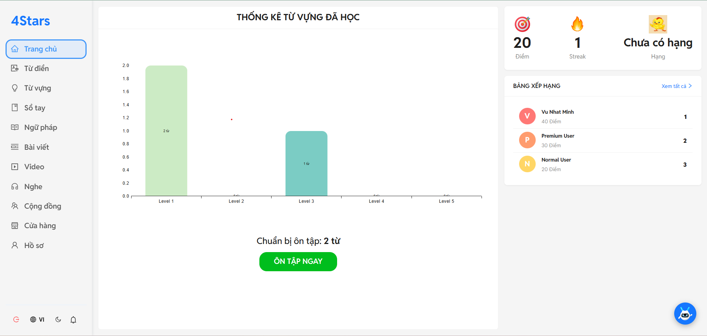
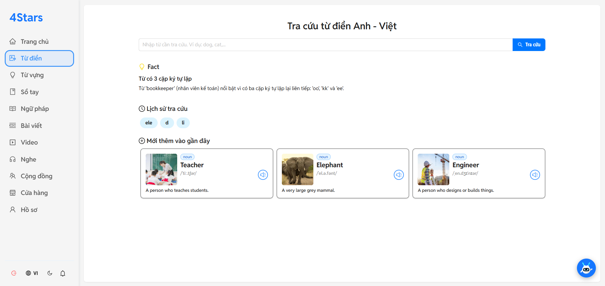
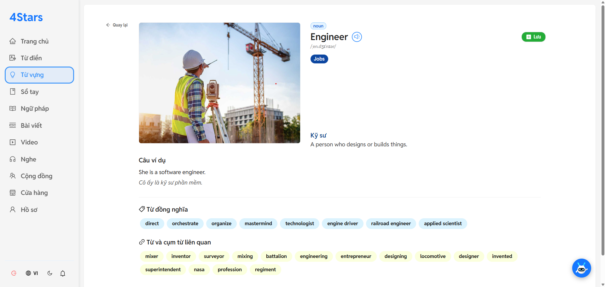
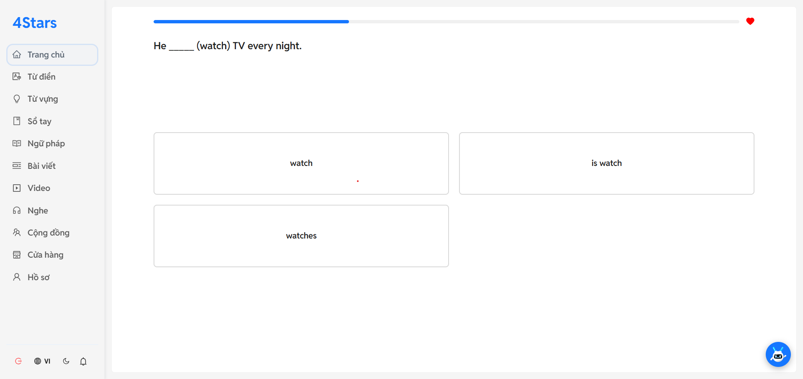
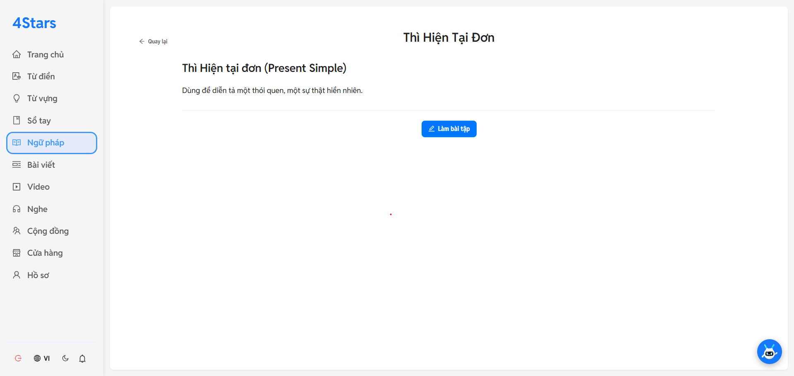
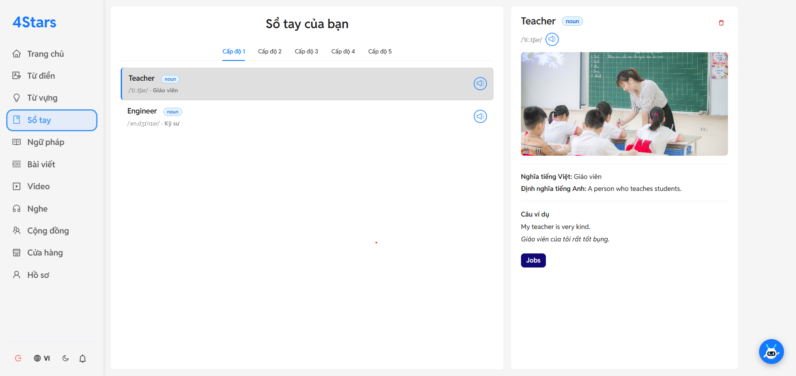
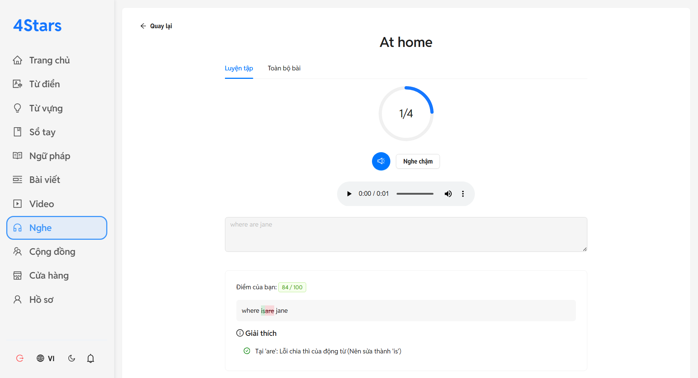
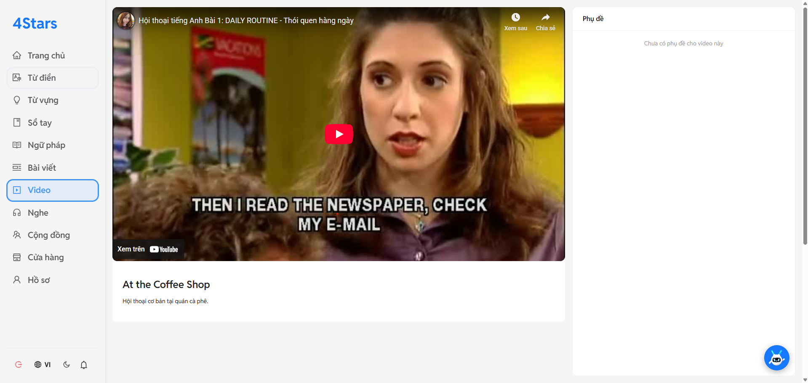
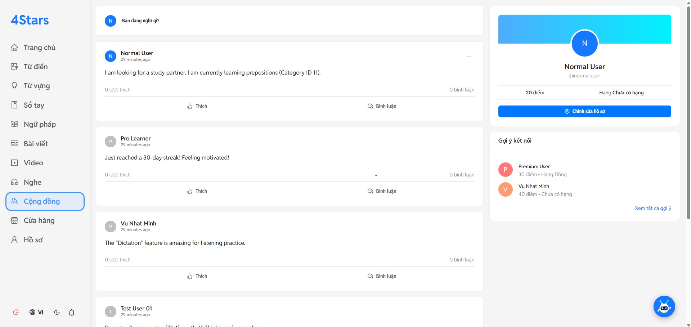
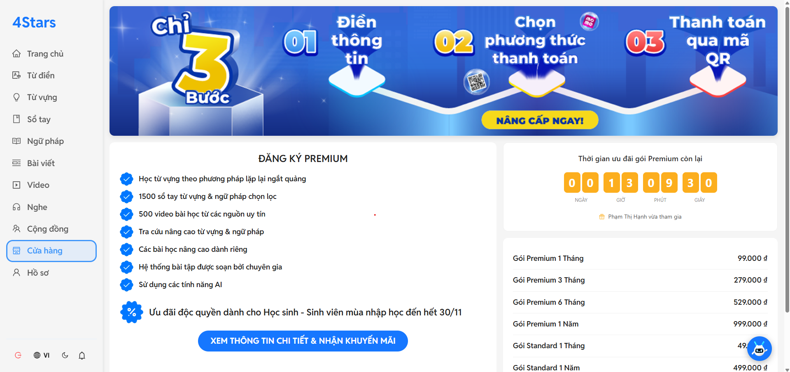

# FourStars English - Nền tảng Học Tiếng Anh Toàn diện

[](https://www.oracle.com/java/technologies/javase/jdk17-archive-downloads.html)
[](https://spring.io/projects/spring-boot)
[](https://www.docker.com/)
[](https://opensource.org/licenses/MIT)

**FourStars English** là một dự án backend cho nền tảng học tiếng Anh full-stack, tập trung vào hiệu năng, khả năng mở rộng và trải nghiệm người dùng tương tác cao. Được tích hợp mô hình **NLP** tự xây dựng.

## 🚀 Tính năng Nổi bật (Features Showcase)

Dưới đây là một vài hình ảnh về các tính năng chính của ứng dụng.

<table>
  <tr>
    <td align="center"><b>Giao diện Ôn tập</b></td>
    <td align="center"><b>Giao diện Từ điển</b></td>
  </tr>
  <tr>
    <td></td>
    <td></td>
  </tr>
  <tr>
    <td align="center"><b>Trang Từ vựng</b></td>
    <td align="center"><b>Trang Quiz</b></td>
  </tr>
  <tr>
    <td></td>
    <td></td>
  </tr>
  <tr>
    <td align="center"><b>Trang Ngữ pháp</b></td>
    <td align="center"><b>Sổ tay Cá nhân</b></td>
  </tr>
    <tr>
    <td></td>
    <td></td>
  </tr>
  <tr>
    <td align="center"><b>Trang Luyện nghe</b></td>
    <td align="center"><b>Trang Video</b></td>
  </tr>
  <tr>
    <td></td>
    <td></td>
  </tr>
    <tr>
    <td align="center"><b>Trang cộng đồng</b></td>
    <td align="center"><b>Trang nâng cấp tài khoản</b></td>
  </tr>
  <tr>
    <td></td>
    <td></td>
  </tr>
</table>


## 🏛️ Kiến trúc Hệ thống

Hệ thống được thiết kế theo kiến trúc hiện đại, container hóa và sẵn sàng cho việc mở rộng.

 ```
                     +--------------------------------------+
Internet User -->    |      NGINX (Reverse Proxy, SSL)      |
                     +------------------+-------------------+
                                        |
                 +----------------------+----------------------+
                 |                                             |
                 v                                             v
      +----------------------+                  +-------------------------+
      |    Frontend App      |                  |      Backend API        |
      |    (React/Vite)      |                  |      (Spring Boot)      |
      |   Served from disk   |                  |   (Container @8080)     |
      +----------------------+                  +-----------+-------------+
                                                            |
                              (Docker Internal Network)     |
                                                            |
          +---------------------+-----------------+---------+------------------+
          |                     |                 |                            |
          v                     v                 v                            v
+------------------+  +----------------+  +----------------+  +----------------------+
|     Database     |  |      Redis     |  |    RabbitMQ    |  |   Python AI API      |
|    (MariaDB)     |  |     (Cache)    |  |  (Message Q)   |  |      (FastAPI)       |
+------------------+  +----------------+  +----------------+  +----------------------+

 ```
* **Nginx** đóng vai trò là Reverse Proxy, xử lý tất cả các request, phân phối đến Frontend hoặc Backend và quản lý HTTPS.
* Toàn bộ hệ thống backend (Java, Python, Database, Redis, RabbitMQ) được **container hóa bằng Docker** và dàn dựng bởi **Docker Compose**, đảm bảo tính nhất quán và di động.
* Các service giao tiếp với nhau qua một mạng nội bộ an toàn của Docker.

## 🛠️ Công nghệ Sử dụng (Tech Stack)

| Hạng mục               | Công nghệ                                                                                                                              |
| ---------------------- | -------------------------------------------------------------------------------------------------------------------------------------- |
| **Backend** | Java 17, Spring Boot 3, Spring Security, Spring Data JPA (Hibernate), MapStruct                                                        |
| **Database** | MariaDB (Tương thích MySQL)                                                                                                            |
| **Caching** | Redis                                                                                                                                  |
| **Messaging** | RabbitMQ                                                                                                                               |
| **Real-time** | WebSocket (STOMP)                                                                                                                      |
| **Xác thực** | JWT (Access + Refresh Token Rotation), OAuth2 (Google Login)                                                                           |
| **DevOps** | Docker, Docker Compose, Nginx                                                                                                          |
| **Testing** | JUnit 5, Mockito                                                                                                                       |
| **API Documentation** | Swagger / OpenAPI 3                                                                                                                    |
| **External APIs** | VNPay Payment Gateway, Google OAuth2, YouTube Data API v3                                                                              |

## ✨ Điểm nhấn

Dự án này áp dụng nhiều kỹ thuật và kiến trúc:

* **Hệ thống Phân quyền Động (Dynamic RBAC):** Quyền hạn (permission) của từng vai trò (role) được quản lý trong database và có thể được thay đổi mà không cần deploy lại code, thông qua một `CustomPermissionEvaluator`.
* **Kiến trúc Bất đồng bộ & Bền bỉ:** Sử dụng **RabbitMQ** để xử lý các tác vụ tốn thời gian (chấm điểm quiz, cập nhật streak) và các sự kiện (gửi thông báo, cập nhật UI real-time) ở chế độ nền. Điều này giúp API phản hồi ngay lập tức và tăng khả năng chịu lỗi của hệ thống.
* **Tối ưu hóa Hiệu năng:**
    * Giải quyết triệt để **vấn đề N+1 Query** bằng `@EntityGraph`.
    * Sử dụng **Redis Cache** cho các dữ liệu được truy cập thường xuyên (quyền hạn, danh mục...) để giảm tải cho database.
    * Áp dụng **Batch Processing** cho các tác vụ import dữ liệu lớn.
* **Hệ thống Gamification Toàn diện:** Kết hợp chặt chẽ giữa **Điểm, Huy hiệu, Chuỗi ngày học (Streak)** và **Bảng xếp hạng** (tuần/toàn thời gian) để thúc đẩy sự tương tác của người dùng.
* **Tích hợp AI & Tự động hóa Nội dung:**
    * Tự động tạo ra các bài quiz đa dạng từ từ vựng mới hoặc từ một danh mục.
    * Tích hợp với mô hình deeplearning **NLP** tự xây dựng cung cấp tính năng Nghe-Chép Chính tả và phân tích lỗi ngữ pháp.
* **Tương tác Thời gian thực:** Sử dụng **WebSocket** để gửi thông báo real-time, cập nhật số lượt thích và bình luận mới ngay lập tức mà không cần tải lại trang.
* **Bảo mật Chuyên sâu:**
    * Luồng xác thực an toàn với **JWT** và cơ chế **Refresh Token Rotation**.
    * Tích hợp **Đăng nhập(Google Login)** qua OAuth2.
    * Cấu hình bảo mật chặt chẽ cho từng API, phân biệt rõ ràng giữa các endpoint công khai, yêu cầu xác thực và yêu cầu quyền Admin.
* **Quy trình DevOps Chuyên nghiệp:**
    * **Container hóa** toàn bộ ứng dụng bằng **Docker** và **Docker Compose**.
    * Sử dụng file **`.env`** để quản lý các biến môi trường và thông tin nhạy cảm.
    * Thiết lập luồng deploy hoàn chỉnh lên server VPS với **Nginx Reverse Proxy** và **HTTPS/SSL** miễn phí từ Let's Encrypt.
    * Cấu hình **Logging** chi tiết cho các môi trường khác nhau (dev/prod) bằng Logback.
    * Sử dụng **Spring Boot Actuator** để giám sát và theo dõi "sức khỏe" của ứng dụng.

## 🌳 Hệ sinh thái Toàn bộ Dự án

Đây là project backend, là trái tim của một hệ sinh thái gồm 3 phần:

* **Backend:** - Xây dựng bằng Spring Boot, chịu trách nhiệm xử lý toàn bộ logic nghiệp vụ, quản lý dữ liệu và bảo mật.
* **Frontend:** (https://github.com/hnimkwazeo/UI.git) - Xây dựng bằng React/Vite, cung cấp giao diện người dùng hiện đại, tương tác cao.
* **AI Service:** (https://github.com/hnimkwazeo/AI.git) - Xây dựng bằng Python/FastAPI, chứa mô hình NLP tự train để phục vụ tính năng phân tích chính tả.

## 🚀 Bắt đầu (Getting Started)

Hướng dẫn để chạy dự án này ở môi trường local.

### Yêu cầu
* Java 17
* Maven 3.x
* Docker và Docker Compose

### Các bước
1.  **Clone a project:**
    ```bash
    git clone (https://github.com/hnimkwazeo/BTL-OOP---Xay-dung-he-thong-hoc-tieng-anh-tich-hop-AI.git)
    cd BTL-OOP---Xay-dung-he-thong-hoc-tieng-anh-tich-hop-AI
    ```
2.  **Tạo file `.env`:**

3.  **Chạy bằng Docker Compose:**
    ```bash
    docker-compose up -d
    ```
4.  Ứng dụng sẽ chạy tại `http://localhost:8080`.

## ✍️ Tác giả

* **Nhóm 16.01**
